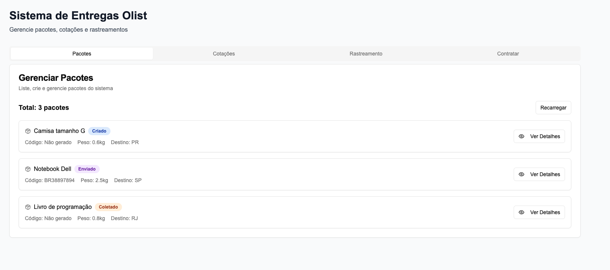
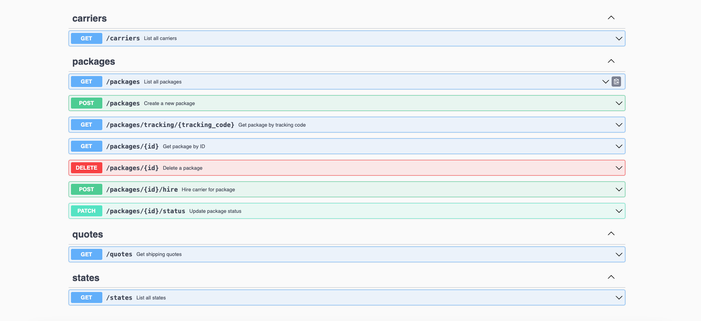

# Olist Shipping API

**API para gerenciamento de entregas da Olist** - Sistema completo para cotação de fretes, controle de pacotes e integração com transportadoras.

## 📋 Descrição

Aplicação desenvolvida para gerenciar envios de pacotes por diferentes transportadoras, permitindo registrar pacotes, consultar status de envio, simular custos com base em peso e região, e contratar a melhor transportadora para realizar a entrega.

## 🚀 Demo
- **Backend API AWS**: [http://18.229.118.66:8080](http://18.231.246.36:8080)

- **Frontend**: [https://moura-olist-front.dh7veh.easypanel.host/](https://moura-olist-front.dh7veh.easypanel.host/)

- 


- **Documentação Swagger**: [http://18.229.118.66:8080/swagger/index.html](http://18.229.118.66:8080/swagger/index.html)
  

## 🚀 Recursos

### Backend (Go + Gin)
- ✅ API RESTful completa
- ✅ Documentação Swagger automática
- ✅ Validação de dados customizada
- ✅ Migrations com golang-migrate
- ✅ Testes unitários e de integração
- ✅ Docker e Docker Compose
- ✅ CORS configurado para qualquer origem

## 🛠️ Tecnologias

**Backend:**
- Go 1.21+
- Gin Web Framework
- PostgreSQL
- SQLC para geração de código
- Swagger/OpenAPI
- Docker & Docker Compose

## 📋 Pré-requisitos

- Go 1.21 ou superior
- Node.js 18+ e npm/yarn
- Docker e Docker Compose
- PostgreSQL (opcional, pode usar Docker)


### Instalacao das Ferramentas

#### Golang-Migrate
```bash
# MacOS
brew install golang-migrate

# Ubuntu/Debian
apt install migrate

# Windows (chocolatey)
choco install migrate
```

#### SQLC
```bash
# MacOS
brew install sqlc

# Go install
go install github.com/sqlc-dev/sqlc/cmd/sqlc@latest
```


## 🚀️ Como Rodar

### 📊 Backend

#### 1. Clone o projeto
```bash
git clone https://github.com/moura95/olist-shipping-api
cd olist-shipping-api
```

#### 2. Instale as dependências
```bash
go mod tidy
```

#### 3. Configure o ambiente
```bash
cp .envexample .env
# Edite o arquivo .env com suas configurações
```

#### 4. Com Docker (Recomendado)
```bash
# Inicia banco + migrations + aplicação
make start

# Ou manualmente
docker-compose up -d
make migrate-up
go run cmd/main.go
```

A API estará disponível em: `http://localhost:8080`

### 🎨 Opcional- Frontend

#### 1. Navegue para o diretório do frontend
```bash
cd web/shipping-web
```

#### 2. Instale as dependências
```bash
npm install
# ou
yarn install
```

#### 4. Execute o projeto
```bash
npm run dev
# ou
yarn dev
```

O frontend estará disponível em: `http://localhost:3000`

## 🧪 Testes

### Backend
```bash
# Rodar todos os testes
make test

# Testes unitários apenas
make test-unit

# Testes de integração
make test-integration

# Testes por camada
make test-service
make test-repository
```

## 📚 Endpoints da API

### 📦 Pacotes
| Método | Endpoint | Descrição |
|--------|----------|-----------|
| `POST` | `/api/v1/packages` | Criar novo pacote |
| `GET` | `/api/v1/packages` | Listar todos os pacotes |
| `GET` | `/api/v1/packages/{id}` | Buscar pacote por ID |
| `GET` | `/api/v1/packages/tracking/{code}` | Buscar por código de rastreio |
| `PATCH` | `/api/v1/packages/{id}/status` | Atualizar status do pacote |
| `POST` | `/api/v1/packages/{id}/hire` | Contratar transportadora |
| `DELETE` | `/api/v1/packages/{id}` | Deletar pacote |

### 💰 Cotações
| Método | Endpoint | Descrição |
|--------|----------|-----------|
| `GET` | `/api/v1/quotes?estado_destino=SP&peso_kg=2.0` | Obter cotações de frete |

### ℹ️ Informações
| Método | Endpoint | Descrição |
|--------|----------|-----------|
| `GET` | `/api/v1/carriers` | Listar transportadoras |
| `GET` | `/api/v1/states` | Listar estados brasileiros |
| `GET` | `/healthz` | Health check |

## 💡 Exemplos de Uso

### Criar um Pacote
```bash
curl -X POST http://localhost:8080/api/v1/packages \
  -H "Content-Type: application/json" \
  -d '{
    "produto": "Camisa tamanho G",
    "peso_kg": 0.6,
    "estado_destino": "PR"
  }'
```

### Cotação de Frete
```bash
curl "http://localhost:8080/api/v1/quotes?estado_destino=SP&peso_kg=2.0"
```

### Contratar Transportadora
```bash
curl -X POST http://localhost:8080/api/v1/packages/{id}/hire \
  -H "Content-Type: application/json" \
  -d '{
    "transportadora_id": "660e8400-e29b-41d4-a716-446655440001",
    "preco": "25.90",
    "prazo_dias": 5
  }'
```

## 🏗️ Regras de Negócio

### 🚚 Transportadoras Disponíveis

#### Nebulix Logística
- **Regiões:** Sul e Sudeste
- **Prazo:** 4 dias
- **Preço:** R$ 5,90/kg

#### RotaFácil Transportes
- **Sul/Sudeste:** 7 dias - R$ 4,35/kg
- **Centro-Oeste:** 9 dias - R$ 6,22/kg
- **Nordeste:** 13 dias - R$ 8,00/kg

#### Moventra Express
- **Centro-Oeste:** 7 dias - R$ 7,30/kg
- **Nordeste:** 10 dias - R$ 9,50/kg

### 📊 Status dos Pacotes
```
criado → esperando_coleta → coletado → enviado → entregue
                                    ↘ extraviado (status especial)
```

### 💵 Cálculo de Preços
```
Preço Final = Peso (kg) × Preço por kg da transportadora
```
## 🏛️ Arquitetura

O projeto segue uma arquitetura com separação clara de responsabilidades:

```
cmd/                    # Entry points
├── main.go

internal/               # Código da aplicação
├── handler/           # HTTP handlers (controllers)
├── service/           # Regras de negócio
├── repository/        # Acesso a dados (gerado pelo SQLC)
├── middleware/        # Middlewares (CORS, rate limit, logging)
└── server.go         # Setup do servidor

api/v1/               # Tipos da API
├── packages.go       # Request/Response types
└── response.go       # Helpers de resposta

config/               # Configurações
pkg/                  # Utilities
├── validator/        # Validações customizadas
├── ginx/            # Helpers do Gin
└── tracking/        # Geração de códigos

db/                   # Database
├── migrations/       # SQL migrations
└── queries/         # SQL queries (SQLC)

tests/               # Testes organizados
├── repository/      # Testes de repository
└── service/        # Testes unitários e integração
web/               # Frontend
├── shipping-web/      
```

## 🔄 CI/CD

O projeto possui pipeline completa com GitHub Actions:

### Pipeline Stages
1. **Test** - Execução de testes
2. **Build** - Compilação da aplicação
3. **Docker Build** - Criação da imagem
4. **Deploy** - Deploy automático no Aws Fargate

### Deploy
- **Ambiente:** Aws Fargate
- **Trigger:** Push na branch `main`
- **Database:** PostgreSQL dedicado
- **Monitoring:** Health checks automáticos

## 📁 Collection Postman

Importe a collection para testar a API:
```
docs/olist_shipping_collection.json
```

## 🔧 Comandos Úteis

```bash
# Desenvolvimento
make run              # Roda a aplicação
make test            # Executa todos os testes
make migrate-up      # Aplica migrations
make migrate-down    # Reverte migrations

# Docker
make up              # Sobe ambiente completo
make down            # Para ambiente
make restart         # Reinicia ambiente

# Database
make sqlc            # Gera código SQLC
make migrate-create  # Cria nova migration

# Documentação
make swag            # Gera Swagger docs
```

## 👨‍💻 Autor

**Guilherme Moura** - *Engenheiro de Software*
- GitHub: [@moura95](https://github.com/moura95)
- LinkedIn: [Guilherme Moura](https://linkedin.com/in/guilherme-moura95)
- Email: junior.moura19@hotmail.com

---